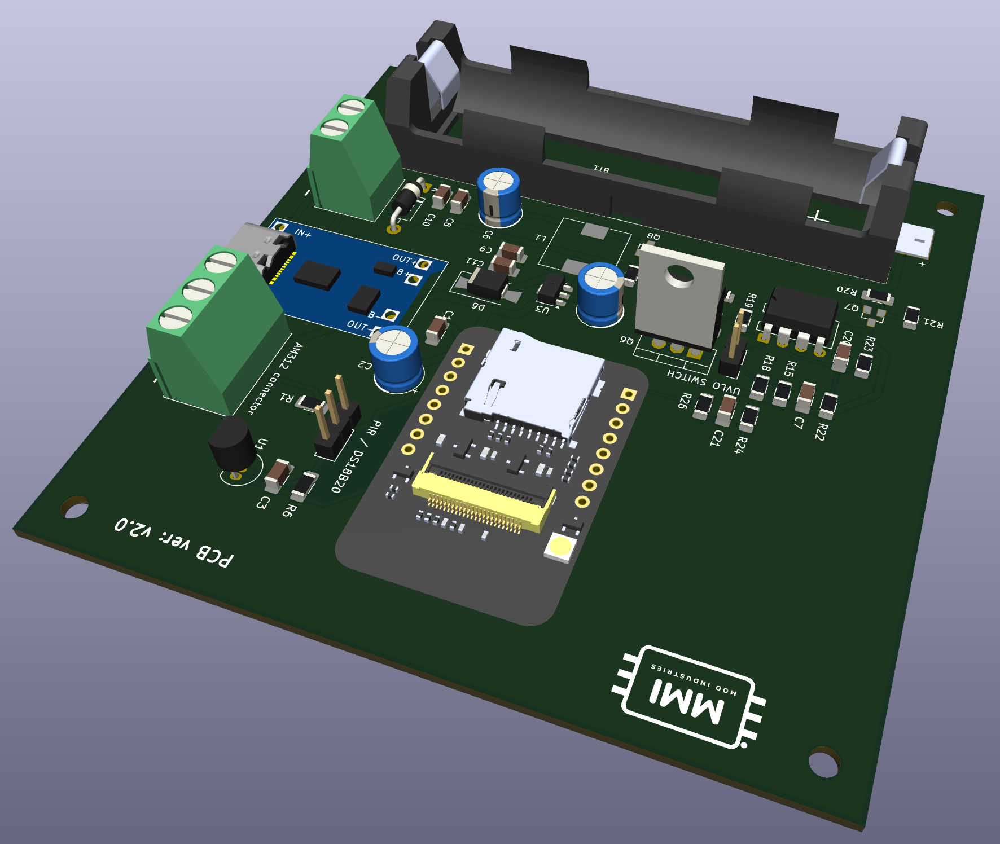

# BirdNest ESP32-CAM Project

BirdNest is a battery-aware ESP32-CAM wildlife and bird nest monitoring project built with PlatformIO and Arduino. It captures photos on schedule or command, sends images and status updates to Telegram, and supports MQTT telemetry for smart home and IoT integrations. The firmware includes deep sleep power saving, OTA remote updates, WiFi recovery logic, DS18B20 temperature monitoring, and calibrated battery voltage reporting for reliable long-term outdoor operation.

**Single firmware binary model.** All cameras share one firmware build. Device-specific identity (label, OTA hostname, AP name) is stored in NVS at runtime, with a MAC-address-based fallback for first boot. Identity can be changed remotely via Telegram commands without reflashing.

**GitHub OTA.** Starting from v0.1.0, firmware releases are published to GitHub automatically via CI. Each device can check for and install updates over HTTPS, with SHA-256 verification and optional A/B rollback. Updates are controlled via Telegram commands at runtime.

## Hardware Design Files (KiCad)

The hardware design assets are stored in `hardware/BirdNest_pcb/`.

- Schematic: `hardware/BirdNest_pcb/BirdNest_pcb.kicad_sch`
- PCB layout: `hardware/BirdNest_pcb/BirdNest_pcb.kicad_pcb`
- KiCad project: `hardware/BirdNest_pcb/BirdNest_pcb.kicad_pro`
- KiCad project local settings: `hardware/BirdNest_pcb/BirdNest_pcb.kicad_prl`
- Backup folder: `hardware/BirdNest_pcb/BirdNest_pcb-backups/`

### 3D PCB View



---

## Complete Hardware Pin Mapping (AI-Thinker ESP32-CAM)

| Function | Pin | Notes |
|---|---|---|
| XCLK | GPIO0 | 20 MHz camera clock |
| Camera D0 (Y2) | GPIO5 | Data pin |
| Camera D1 (Y3) | GPIO18 | Data pin |
| Camera D2 (Y4) | GPIO19 | Data pin |
| Camera D3 (Y5) | GPIO21 | Data pin |
| Camera D4 (Y6) | GPIO36 | Data pin |
| Camera D5 (Y7) | GPIO39 | Data pin |
| Camera D6 (Y8) | GPIO34 | Data pin |
| Camera D7 (Y9) | GPIO35 | Data pin |
| HREF | GPIO23 | Control line |
| VSYNC | GPIO25 | Control line |
| PCLK | GPIO22 | Control line |
| SDA (I2C) | GPIO26 | Camera I2C data |
| SCL (I2C) | GPIO27 | Camera I2C clock |
| OneWire (DS18B20) | GPIO13 | OneWire bus |
| ADC (Battery) | GPIO12 | Battery voltage measurement |
| Flash LED | GPIO4 | PWM control |

## Hardware modification

On the ESP32CAM the AMS1117 has been replaced with AP7361C-33ER-13 which consumes less. 

---

## Complete Boot Sequence (PHASE 1 in setup())

1. **Serial init** — initialize UART at 115200 baud for debug output
2. **tempInit()** — DS18B20 on GPIO13 OneWire bus with internal pull-up
3. **batteryInit()** — GPIO12 ADC setup for battery voltage reading
4. **WiFi connect phase** — STA connect with boot retries; rescue captive portal on repeated failures; deep-sleep fallback when boot connectivity cannot be recovered
5. **otaInit()** and startup OTA window — check for ArduinoOTA updates (`OTA_STARTUP_WINDOW_SEC`, or `OTA_RECOVERY_WINDOW_SEC` when recovery is armed)
5b. **ghOtaInit()** — initialize GitHub OTA module after the ArduinoOTA window settles; confirm post-install rollback health if `ESP_OTA_IMG_PENDING_VERIFY`; run auto-check and install if `otaAuto=true`
6. **syncTimeIfNeeded()** — NTP sync with up to 30 retries, 200ms between each
7. **telegramInit()** and startup message processing — initialize Telegram bot and handle first message
8. **nightSleepIfNeeded()** — if after sunset, sleep until sunrise using week-number lookup table
9. **Welcome / startup photo decision** — send welcome message only on normal boot; on timer wake, capture+send photo if maintenance mode is off
10. **Final deep sleep decision** — call `esp_deep_sleep_start()` when sleep interval is enabled and OTA is not active

---

## Photo Capture Sequence (PHASE 2)

1. **cameraInit()** — configure AI-Thinker pins (D0-D7, HREF, VSYNC, PCLK, XCLK, SCCB), JPEG mode, and grab mode
2. **PSRAM profile select** — if PSRAM is present use PSRAM frame/quality flags and `fb_count=2`, otherwise fallback profile with `fb_count=1`
3. **Init resilience** — handle `ESP_ERR_INVALID_STATE` with deinit+retry, plus second init retry after 500 ms
4. **Sensor tuning** — apply white balance, AGC/AEC settings, orientation (`/mirror` and `/flip`), and light-based OV2640 register ladder
5. **Warm-up capture phase** — capture `CAMERA_WARMUP_FRAMES` frames (current active profile: 4), with frame-grab retries (`CAMERA_FB_GET_RETRIES`)
6. **Final fallback capture** — if all warm-up grabs fail, run one final retried frame-grab attempt
7. **HTTPS multipart upload** — send Telegram `sendPhoto` request with chunked JPEG write (`8 KB` chunks) over `WiFiClientSecure`
8. **Response validation** — parse response body and treat only `"ok":true` as success; store detailed failure reason otherwise
9. **Upload retry loop** — outer retry in `captureAndSendPhoto()` with WiFi reconnect and progressive backoff (`PHOTO_SEND_RETRY_BACKOFF_MS * attempt`)
10. **cameraDeinit()** — deinitialize camera and wait 100 ms before any next init

---

## Telegram Command Processing (PHASE 3 in loop())

- 5-second polling interval
- Update ID persistence every 30 seconds
- Command table: `/status`, `/help`, `/photo`, `/sleepXX`, `/maint_on`, `/maint_off`, `/netdiag`, `/reboot`, `/reboot_ota`, `/setlabel`, `/sethostname`, `/bootstrap_prepare`, `/reset_config`, `/debug0|1|2`, `/mirror0|1`, `/flip0|1`, `/battcal`, `/battcalset`, `/battcalclear`, `/mqtt`, `/mqttset`, `/mqtttopic`, `/mqtttopic_reset`, `/mqttoff`, `/otastatus`, `/otaupdate_check`, `/otaupdate_now`, `/otaupdate_auto_on`, `/otaupdate_auto_off`, `/otachannel`, `/otatoken_set`, `/otatoken_clear`
- `/status` returns status only; full command listing is in `/help`
- Callback execution for each command

---

## Deep Sleep & Wakeup (PHASE 4)

- ESP32 hibernates: CPU off, RTC timer running
- Current draw: 100–500 µA during deep sleep
- Wakeup detection via `esp_sleep_get_wakeup_cause()`
- `fromSleep` flag behavior: sets `fromSleep` to true on wake, false on normal boot

---

## Detailed Module Descriptions

### WiFi Manager
- Telegram credential check from NVS (`botToken`, `chatId`, `debugChatId`) before connect flow
- Fail-fast STA reconnect path (`WIFI_FAIL_FAST_SEC`) when captive portal is disabled
- Rescue captive portal opens on missing Telegram fields or repeated boot failures
- Persistent WiFi failure counter (`wifiFail`) in NVS; reset to 0 on successful connect

## WiFi Connection Lifecycle (full program behavior)

### 1) Boot-time connection strategy

- The device first loads Telegram credentials and WiFi failure counter from NVS.
- If captive portal is disabled and Telegram fields are present, it tries normal STA reconnect first (`wifiInit()`).
- Boot retries are applied by the main program:
	- `WIFI_BOOT_CONNECT_RETRIES`
	- `WIFI_BOOT_RETRY_BACKOFF_SEC`
- In fail-fast mode, each WiFi attempt uses `WIFI_FAIL_FAST_SEC` timeout.

### 2) Rescue captive portal fallback

- If Telegram credentials are missing, captive portal is opened immediately.
- If `WIFI_ENABLE_CAPTIVE_PORTAL != 0`, portal path is always allowed.
- With repeated STA failures, rescue portal opens after `WIFI_RESCUE_FAIL_COUNT` failures.
- Optional periodic rescue windows use `WIFI_RESCUE_PORTAL_INTERVAL_FAILS`.
- Portal timeout uses `WIFI_RESCUE_PORTAL_TIMEOUT` (rescue) or `CONFIG_PORTAL_TIMEOUT` (normal).
- Captive portal includes custom fields for Telegram token, main chat ID, and debug chat ID.

### 3) Boot failure fallback (failsafe deep sleep)

- If WiFi cannot be established after boot retries, device enters deep sleep backoff.
- Default backoff path uses `WIFI_RETRY_BACKOFF_SEC`.
- If OTA recovery is armed, recovery sleep timing is used instead (`otaGetRecoverySleepSeconds`), including low-battery protection.

### 4) Runtime link-loss handling (while running)

- The loop continuously checks WiFi state before network-heavy tasks.
- On disconnect:
	- reconnect attempts are triggered every `WIFI_RUNTIME_RECONNECT_INTERVAL_SEC`
	- diagnostics counters are updated (`/netdiag`)
- If disconnected too long, failsafe reboot is triggered after `WIFI_RUNTIME_REBOOT_AFTER_SEC`.

### 5) OTA interaction

- OTA processing runs first in loop (`otaLoop()`).
- While OTA is active, other network work is deferred.
- Deep sleep is suppressed during active OTA transfer.
- Startup OTA polling window is dynamic: normal `OTA_STARTUP_WINDOW_SEC`, or extended `OTA_RECOVERY_WINDOW_SEC` when recovery mode is armed.
- OTA transfer watchdog restarts the device if no OTA events arrive for `OTA_STALL_TIMEOUT_SEC`.

### 6) Maintenance mode behavior

- Maintenance mode suppresses automatic sleep/photo cycle decisions, but does not bypass WiFi requirements.
- If network quality is poor, runtime reconnect/failsafe logic still applies.
- Manual diagnostics command: `/netdiag`.

### Telegram
- Bot token stored in NVS
- Poll loop every 5 seconds
- NVS persistence of sleep/maintenance settings
- `lastMsgId` tracking for message updates
- `/help` provides the full command list, while `/status` stays focused on runtime state

### Camera
- AI-Thinker pin mapping: D0–D7 data, HREF/VSYNC/PCLK control, XCLK 20 MHz
- PSRAM-aware frame profile (`CAMERA_FRAMESIZE_*`, `CAMERA_JPEG_QUALITY_*`, `fb_count`)
- Warm-up frames from build flag (`CAMERA_WARMUP_FRAMES`, active profile uses 4)
- JPEG capture and frame buffer
- Upload via HTTPS multipart POST using `WiFiClientSecure` and `writeAll()` helper
- Manual lowlight/day exposure register ladder based on ambient light register (`0x2f`)
- Multi-attempt Telegram photo upload with reconnect/backoff on failure
- Remote error diagnostics via Telegram debug messages (serial not required)

### Camera Exposure / Lowlight Logic (actual implementation)
- Ambient light value is read from sensor register `0x2f`
- `CAMERA_DAY_THRESHOLD` separates lowlight and daylight branches
- AGC is disabled (`set_gain_ctrl(0)`), gain is manual (`set_agc_gain(0)`), and exposure is controlled by register ladder writes
- A post-frame fine-tuning pass adjusts `0x47`, `0x2a`, and `0x2b` for very low to medium light
- Current implementation does not use `CAMERA_DYNAMIC_EXPOSURE_PROFILE`, `CAMERA_DAY_*`, or `CAMERA_LOWLIGHT_*` flag families

### Photo Upload Reliability and Remote Diagnostics
- Upload attempts are retried with progressive backoff and WiFi reconnect between tries.
- Retry behavior is configurable with:
	- `PHOTO_SEND_MAX_RETRIES`
	- `PHOTO_SEND_RETRY_BACKOFF_MS`
	- `CAMERA_FB_GET_RETRIES`
	- `CAMERA_FB_GET_RETRY_DELAY_MS`
- On each failed attempt, the device sends detailed failure reason to Telegram debug chat.
- Final failure message includes the last known upload error cause.

Common remote error reasons (`cameraGetLastError`):

- `empty_chat_id` - no chat ID was provided
- `missing_bot_token` - Telegram bot token is missing/empty
- `wifi_not_connected_before_upload` - WiFi dropped before upload start
- `telegram_tls_connect_failed` - TLS connection to `api.telegram.org:443` failed
- `camera_fb_get_failed_final` - frame grab failed after warm-up and final fallback attempt
- `upload_failed_headers_or_prefix` - multipart request header/prefix write failed
- `upload_chunk_write_failed_offset_N` - JPEG data upload interrupted at byte offset
- `upload_multipart_tail_failed` - multipart tail write failed
- `telegram_response_not_ok_empty_body` - Telegram returned non-OK with empty body
- `telegram_response_not_ok_...` - Telegram API responded with `ok:false` and body snippet

### Temperature
- DS18B20 on GPIO13 OneWire protocol with internal pull-up
- `TEMP_SAMPLE_COUNT` samples averaged (1–2)

### Battery
- ADC on GPIO12 with resistor divider formula
- Two-point calibration math using `bCalA`/`bCalB`
- GPIO12 is ADC2 on ESP32. While WiFi is connected, ADC2 sampling is not reliable/available, so the firmware returns the last cached valid value.
- A fresh battery sample is taken during boot before WiFi connect (`batteryRefresh()` in setup), then reused during active WiFi on ADC2 hardware.
- `/status` reports that cached value on ADC2+WiFi. This is typically the most recent wake-time sample.
- If `/status` is sent while the device is in deep sleep, it is processed after wake, so battery data in the reply reflects the new measurement from that wake cycle.

### Runtime Device Identity

All cameras run the same firmware binary. Each device's identity is stored in NVS and loaded at every boot.

| NVS key | Default | Description |
|---|---|---|
| `devLabel` | `BirdNest-XXXXXXXX` (MAC) | Human-readable device name |
| `otaHost` | `birdnest-xxxxxxxx` (MAC) | ArduinoOTA mDNS hostname |
| AP name | derived from `devLabel` + `-cfg` | Captive portal AP name (not stored separately) |

On first boot the label and hostname are generated from the lower 32 bits of the chip MAC address, so multiple devices with the same factory firmware never collide on the same LAN.

Telegram commands:
- `/setlabel <name>` — change device label (persisted in NVS, affects MQTT topics and photo captions)
- `/sethostname <name>` — change ArduinoOTA hostname (reboot required to apply mDNS)
- `/status` and welcome message show current label and OTA hostname

---

### ArduinoOTA (local network upload)
- Startup OTA window: `OTA_STARTUP_WINDOW_SEC` (default 8 s)
- Extended recovery window: `OTA_RECOVERY_WINDOW_SEC` (default 120 s) when recovery latch is armed
- OTA stall watchdog: restart if transfer is idle for `OTA_STALL_TIMEOUT_SEC`
- Recovery sleep policy: `OTA_RECOVERY_SLEEP_SEC`, with low-battery fallback `OTA_RECOVERY_LOW_BATTERY_SLEEP_SEC` below `OTA_RECOVERY_MIN_BATTERY_V`
- Recovery state is persisted in NVS via `otaArmed` and `otaCycles`
- `/reboot_ota` arms recovery and reboots — opens an extended OTA window for PlatformIO upload

---

### GitHub OTA (automatic over-the-internet updates)

Starting from v0.1.0, every `v*` git tag triggers a CI build that publishes a single firmware binary and `ota-manifest.json` to GitHub Releases. Devices can check and install these releases over HTTPS without physical access.

#### How it works

1. **Check**: device queries `api.github.com/repos/VorosEgyes/BirdNest/releases`, finds the best candidate by SemVer and channel (stable/beta), downloads `ota-manifest.json`.
2. **Install gate**: battery ≥ max(3.60 V, `manifest.min_battery_v`), WiFi stable.
3. **Install**: streams the `.bin` via HTTPS, verifies SHA-256 incrementally, writes to the inactive OTA partition, reboots.
4. **Health confirm**: on first boot after install, pings `api.github.com/rate_limit` up to 3 times; if any succeed, marks the image valid and cancels rollback.

#### Partition table requirement

GitHub OTA install requires an A/B OTA partition layout (`partitions_ota_4m.csv`). Devices previously flashed with `min_spiffs.csv` (single app partition) will run all GitHub OTA code normally but **install will be blocked** with reason `no_update_partition` until the device receives a full flash.

| Scenario | ArduinoOTA upload | GitHub OTA install |
|---|---|---|
| Device with `partitions_ota_4m.csv` | ✅ | ✅ |
| Device with `min_spiffs.csv` (old layout) | ✅ | ❌ blocked |

#### First-install / partition migration guide

To migrate an existing camera from `min_spiffs` to OTA partitions:

1. Connect via USB.
2. Run a full flash (includes partition table + bootloader + firmware):
   ```bash
   pio run -e cam1 -t upload --upload-port /dev/cu.usbserial-XXXX
   # or cam2, cam3, cam4 — all envs produce the same binary
   ```
3. After this one-time flash, all future updates can be done via GitHub OTA with no physical access.

For cameras only reachable via ArduinoOTA, use `/bootstrap_prepare` before the USB flash session to ensure maintenance mode is on and sleep is off.

#### Bootstrap preflight command

`/bootstrap_prepare` — run this before any first-install or partition migration session:
- Sets maintenance mode ON (suppresses deep sleep)
- Sets sleep interval to 0
- Disables WiFi modem sleep
- Arms ArduinoOTA recovery
- Runs and reports a preflight check:
  - Battery ≥ `BOOTSTRAP_MIN_BATTERY_V` (default 3.80 V)
  - WiFi connected and RSSI ≥ `BOOTSTRAP_MIN_RSSI_DBM` (default −82 dBm)
  - Telegram credentials present
  - OTA update partition reachable

Reports `READY` or `NOT READY` with per-check detail.

#### GitHub OTA Telegram commands

| Command | Description |
|---|---|
| `/otastatus` | JSON status: current version, channel, auto mode, pending target, last reason |
| `/otaupdate_check` | Query GitHub releases; report available version or no-update |
| `/otaupdate_now` | Check and immediately install if update found |
| `/otaupdate_auto_on` | Enable automatic check+install on every boot |
| `/otaupdate_auto_off` | Disable automatic updates (manual only) |
| `/otachannel stable\|beta` | Switch release channel |
| `/otatoken_set <token>` | Set GitHub API token (private repos; message auto-deleted) |
| `/otatoken_clear` | Clear token; drops pending private target |

#### Versioning and CI release workflow

- `FW_VERSION` is injected at build time from the nearest git tag via `scripts/fw_version_from_git.py`.
- Local/untagged builds use `0.0.0-dev` as fallback.
- CI (`release-ota.yml`) triggers on any `v*` tag push:
  - Builds `[env:release]` (same binary as camX envs)
  - Calculates SHA-256
  - Uploads `birdnest-esp32cam-vX.Y.Z.bin` and `ota-manifest.json` to GitHub Releases
- Devices on stable channel only see non-prerelease tags; beta channel sees prerelease tags too.

#### Check/backoff policy

- Auto-check runs at most once per day (`GH_OTA_DAILY_CHECK_SEC`).
- WiFi instability increments a fail streak with exponential backoff: 6 h → 12 h → 24 h → 48 h max.
- Backoff is reset after 2 consecutive stable WiFi cycles.
- Manual `/otaupdate_check` and `/otaupdate_now` bypass daily interval and backoff.

#### GitHub OTA NVS keys (namespace: `birdnest_gh`)

| Key | Type | Description |
|---|---|---|
| `otaAuto` | bool | Auto-update enabled |
| `otaChannel` | string | `stable` or `beta` |
| `otaToken` | string | GitHub API token (private repos) |
| `otaLastChk` | uint32 | Unix timestamp of last successful check |
| `otaWifiFail` | uint16 | Consecutive WiFi stability failures |
| `otaChkFail` | uint16 | Consecutive check failures |
| `otaWifiOk` | uint8 | Consecutive stable cycles (for backoff reset) |
| `otaBackoff` | uint32 | Backoff-end timestamp (0 = no backoff) |
| `otaTarget` | string | JSON-serialized pending install target |
| `otaLastReason` | string | Last OTA block/fail reason code |
| `otaRebootFlg` | bool | Set before install reboot, cleared on next boot |
| `otaLastTgt` | string | Version string of last attempted install |

### MQTT
- Runtime MQTT client with automatic reconnect
- JSON status publish to a configurable state topic (channel)
- Config stored in NVS and editable from Telegram
- Supports auth and no-auth brokers
- Periodic publish (`MQTT_STATUS_INTERVAL_SEC`) and immediate publish on boot/config change
- LWT availability support (`online` / `offline`, retained)
- Separate state/event/availability topic model
- Payload schema versioning (`schema_version`)
- GitHub OTA events published via `mqttPublishOtaEvent()` to the event topic

---

## MQTT Setup and Usage

### Default Topics

If no custom topic is set, these topics are used:

- State topic: `birdnest/<deviceLabel>/status`
- Event topic: `birdnest/<deviceLabel>/event`
- Availability topic: `birdnest/<deviceLabel>/availability`

Where `<deviceLabel>` is the runtime device identity loaded from NVS (see Runtime Device Identity section). The default is `BirdNest-XXXXXXXX` based on MAC address.

If you set a custom topic with `/mqtttopic`:

- The custom value is used as the state topic.
- If it ends with `/status`, event and availability are derived as sibling topics.
- Otherwise `/event` and `/availability` are appended.

### Telegram Commands for MQTT

- `/mqtt` - show current MQTT config and active channel
- `/mqttset <ip-or-host> <port> <user|-> <pass|->` - set broker and auth in one message
- `/mqtttopic <topic>` - set custom publish channel/topic
- `/mqtttopic_reset` - reset topic to default (`birdnest/CAMERA_LABEL/status`)
- `/mqttoff` - disable MQTT and clear broker credentials

`/mqtt` now reports:

- State topic
- Event topic
- Availability topic
- Schema version

### One-message setup examples

- Auth enabled:
	- `/mqttset 192.168.1.100 1883 mqtt_user mqtt_pass`
- No auth:
	- `/mqttset 192.168.1.100 1883 - -`

### Channel/topic examples

- Set custom channel:
	- `/mqtttopic birdnest/BirdNestCam1/status`
- Reset to default channel:
	- `/mqtttopic_reset`

### Published payloads

State payload (`status`) is JSON and includes:

- `schema_version`
- `device`
- `reason` (`boot`, `periodic`, `manual`, `config_updated`, ...)
- `ip`
- `rssi`
- `uptime_s`
- `temp_c`
- `battery_v`
- `battery_pct`
- `maint`

Event payload (`event`) is JSON and includes:

- `schema_version`
- `device`
- `event`
- `detail`
- `uptime_s`

GitHub OTA event payload additionally includes:

- `reason` — machine-readable reason code (e.g. `no_update`, `battery_low`, `sha256_mismatch`)
- `current_version` — running firmware version
- `target_version` — target version being installed (empty if check-only)
- `channel` — `stable` or `beta`

OTA event types: `ota_check_start`, `ota_check_no_update`, `ota_update_available`, `ota_install_blocked`, `ota_update_start`, `ota_update_progress`, `ota_update_ok`, `ota_update_fail`, `ota_check_fail`

Availability payload (`availability`) values:

- `online` (retained on successful connect)
- `offline` (retained via LWT or explicit MQTT disable)

---

## NVS Storage Structure

All keys live in the `birdnest` namespace unless otherwise noted.

### Device identity

| Key | Type | Description |
|---|---|---|
| `devLabel` | string | Runtime device label (default: `BirdNest-XXXXXXXX`) |
| `otaHost` | string | ArduinoOTA mDNS hostname (default: `birdnest-xxxxxxxx`) |

### Telegram credentials and runtime config

| Key | Type | Description |
|---|---|---|
| `botToken` | string | Telegram bot token |
| `chatId` | string | Telegram main chat ID |
| `debugChatId` | string | Telegram debug chat ID |
| `sleepSec` | uint32 | Deep sleep interval in seconds |
| `maintMode` | bool | Maintenance mode |
| `dbgVerb` | uint8 | Debug verbosity (0–2) |
| `camMirror` | bool | Camera mirror |
| `camFlip` | bool | Camera vertical flip |
| `lastMsgId` | int32 | Last processed Telegram update ID |

### Battery calibration

| Key | Type | Description |
|---|---|---|
| `bCalEn` | bool | Two-point calibration enabled |
| `bCalA` / `bCalB` | float | Calibration slope / offset |
| `bCalRV1/MV1/RV2/MV2` | float | Calibration reference points |

### ArduinoOTA recovery

| Key | Type | Description |
|---|---|---|
| `otaArmed` | bool | Recovery mode armed |
| `otaCycles` | uint16 | Recovery cycles remaining |

### WiFi

| Key | Type | Description |
|---|---|---|
| `wifiFail` | uint16 | Consecutive WiFi boot failure counter |

### MQTT

| Key | Type | Description |
|---|---|---|
| `mqttHost` | string | Broker host/IP |
| `mqttPort` | uint16 | Broker port |
| `mqttUser` | string | Username (optional) |
| `mqttPass` | string | Password (optional) |
| `mqttTopic` | string | Custom state topic (optional) |

### GitHub OTA (namespace: `birdnest_gh`)

| Key | Type | Description |
|---|---|---|
| `otaAuto` | bool | Auto-update enabled |
| `otaChannel` | string | `stable` or `beta` |
| `otaToken` | string | GitHub API token |
| `otaLastChk` | uint32 | Unix timestamp of last check |
| `otaWifiFail` | uint16 | WiFi stability fail streak |
| `otaChkFail` | uint16 | Check fail streak |
| `otaWifiOk` | uint8 | Stable cycles counter (backoff reset) |
| `otaBackoff` | uint32 | Backoff end timestamp |
| `otaTarget` | string | Pending install target (JSON) |
| `otaLastReason` | string | Last block/fail reason code |
| `otaRebootFlg` | bool | Set before install reboot |
| `otaLastTgt` | string | Last attempted install version |

---

## Power Consumption & Battery Life

- Awake: ~80–150 mA
- WiFi connecting: ~150 mA
- Camera: ~200 mA
- Deep sleep: ~0.1–0.5 mA

Example: 2000 mAh battery with 5-min photo interval = 100+ hours of operation
Night sleep (12 hours OFF) saves 50%+ battery


